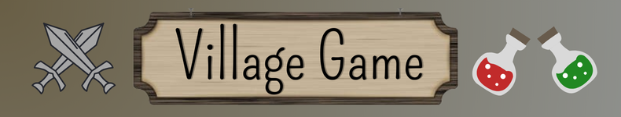
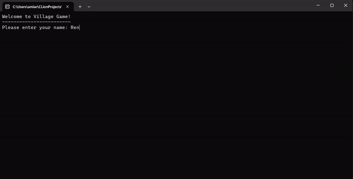
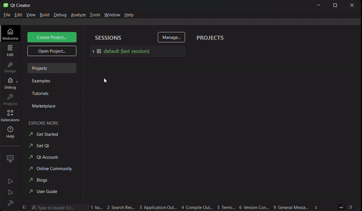
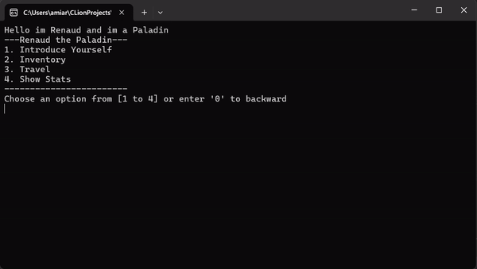

<p align="center">
  
</p>

---

## 📖 Table of contents

1. ⚔️ [What is The Village Game ?](#what-is-village)
2. 🕹️ [Demo](#demo)
3. 🛠️ [How to install](#installation)
4. 🪄 [Nice Features](#nice-features)  
   4.1 🖼️ [ Dynamic Menus](#41-dynamic-menus)  
   4.2 😈 [ Monster Diversity](42-monster-diversity)  
   4.3 🎵 [ Sound effects / Musics](#43-musics)
5. 📚 [Class Diagrams](#class-diagrams)  
    5.1 🧠 [Game-Logic Diagram](#51-logic-diagram)  
    5.2 ⛓️ [Menu Diagram](#52-menu-diagram)
6. 🌐 [Credits](#credits)
7. 📎 [Appendix](#appendix)

## <a name="what-is-village">⚔️ What is Village Game ?</a>

Village Game is a school game console project made in **C++** language that we had to do  
to train ourselves to make OOP programs.

This game take place in a Village named **FroopyLand**  
where you are a lonely Hero who just want to drink beer and fight monsters .

In **FroopyLand** you can :
- Go to the **'🍻Drunk Shrimp Tavern🍻'** to drink some nice beers after a fight
- Do some shopping at the **'⚔️Potion & Blade Bazaar🛡️'**
- Relax yourself by fighting monsters in the **'🧟‍♂️Paraceta'mole Cave🐲'**  
  (*be careful a legend say that you can find some dragons 😬*)

If the monsters get the upper hand on you, you will lose 🤕

## <a name="demo"> 🕹️ Demo </a>



## <a name="installation">  🛠️ How to Install</a>

To install the game, you will need to have on your machine :

[](https://git-scm.com/downloads)
[](https://www.qt.io/download-dev)

### Installation with GitBash
```bash
git clone https://github.com/Ewoukouskous/TP_leVillage.git
cd TP_leVillage//
```

### Run with Qt Creator  



- Run QT Creator ➡️ Open a Project ➡️ Go to game directory ➡️ Open the CMakeLists.txt file
- Go to Projects options ➡️ Run options ➡️ Check the 'Run in terminal' box
- Go to Qt Creator Preferences ➡️ Terminal settings (all the way down) ➡️  Uncheck the 'Use the intern terminal' box
- Run the program and enjoy 😉 ! 

>❗For a better user experience we recommend to activate the sound and run Qt with administrator right (for the SFX and terminal resize)❗
## <a name="nice-features"> 🪄 Nice features </a>

### 🖼️ Dynamic Menus
The game contain dynamic menus made using OOP, the displayed menu will depend on where you are and what you do.  
For example the menu will change if you go in a Mine and while you're in the Mine you check your Inventory by calling the Inventory Menu



___

### 😈 Monsters diversity

In the Mine you can fall onto 3 types of Monster :
- **The Slime 🟢** (a low level Monster, that you can squish if you are a minimum strong)
- **The Zombie 🧟‍♂**️ (a medium level Monster, he do an average amount of damage)
- **The Dragon 🐲** (he appears in the depth of the Mine and he's very strong)

All the Monsters have different stats and give you a different amount of gold when you kill them  
(stronger there are, more gold they give)

___

### 🎵 Sound effects / Musics

We implemented sounds in the game, but don't want to talk about it much  
because we'll love you to discover them by yourself 😊  

So we **HIGHLY** recommend you to activate the sound of your computer.  


## <a name="class-diagrams"> 📚 Class Diagrams </a>

### <a name="#51-logic-diagram"> 🧠 Game-Logic Diagram </a>

[](readme-files/diagram)

___

### <a name="#52-menu-diagram"> ⛓️ Menu Diagram </a>

[](readme-files/diagram)

## <a name="credits"> 🌐 Credits <a/>

### The Village Game made by :
- [AMIARD Renaud](https://ytrack.learn.ynov.com/git/arenaud)
- [LEFEBVRE Nino](https://ytrack.learn.ynov.com/git/lenino)

---

### Musics used for the game :

- The 'Drunk Shrimp Tavern' music : [Shrimp Quartet by justan oval](https://www.youtube.com/watch?v=u4ecB57jFhI&ab_channel=justanoval)
- The 'Potion & Blade Bazaar' music : [Wii shop song](https://www.youtube.com/watch?v=yyjUmv1gJEg&ab_channel=RhythmRoot)
- The 'Paraceta'mole Cave' music : [Microfrog by Bellasaurus](https://www.youtube.com/watch?v=Xpf5P7X0sNo&ab_channel=Bellasaurus)

